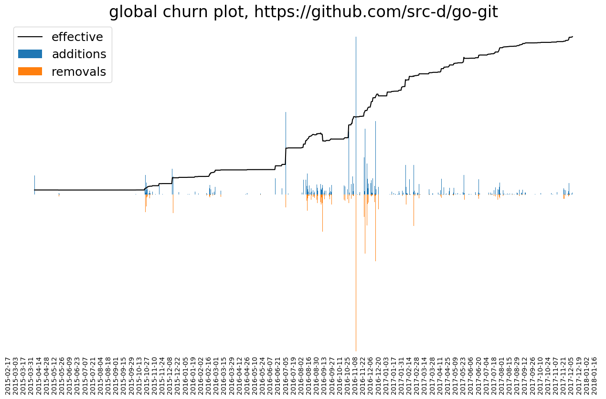

# Hercules plugins

### Status and requirements

Plugins are supported, with the constraints inherent to
[Go plugins](https://pkg.go.dev/plugin):

- **cgo is mandatory.** Both the plugin and the `hercules` binary which loads it must be
  built with `CGO_ENABLED=1`. The default build (`just`, releases, Docker) is
  `CGO_ENABLED=0` and refuses to load any plugin (`--plugin` prints
  "Failed to load plugin ... plugin: not implemented"). When building hercules with cgo,
  add `-tags purego` (or `-tags systemfreetype` with system FreeType installed) — the
  render stack's cgo FreeType path is not shipped.
- **The toolchain and source tree must match.** A plugin only loads into a binary built
  with the same Go version, the same module source and the same build tags.
- **Linux and macOS only** — Go plugins are not supported on Windows.

The whole path is covered by a compatibility smoke test: `just test-plugin`
(`test/plugin_smoke/`), which builds a [minimal plugin](test/plugin_smoke/testdata/minimal_plugin/minimal.go)
and a cgo hercules binary from the current tree and runs an analysis with it.

### Prerequisites

Install the same pinned [GoGo Protobuf](https://github.com/gogo/protobuf) generator
used by Hercules:

```bash
GOBIN="$(go env GOPATH)/bin" go install github.com/gogo/protobuf/protoc-gen-gogo@v1.3.2
export PATH="$(go env GOPATH)/bin:$PATH"
```

The `protoc` tool must also be available in `$PATH`. Hercules generation and CI use
version 3.20.3, available from the
[official Protocol Buffers releases](https://github.com/protocolbuffers/protobuf/releases/tag/v3.20.3).

### Creating a new plugin

Generate a new plugin skeleton from a Hercules checkout. Keeping the plugin in that
module ensures it is compiled against the same Hercules source as the host binary:

```bash
hercules generate-plugin -n MyPluginName -o my_plugin
```

This command creates:

- `my_plugin/my_plugin_name.go` with the plugin source code. See
  [`LeafPipelineItem`](https://pkg.go.dev/github.com/cwbudde/hercules#LeafPipelineItem).
- `my_plugin/my_plugin_name.proto`, which defines the Protocol Buffers schema of the result.
- `my_plugin/my_plugin_name.pb.go`, generated from the protobuf schema.
- `my_plugin/Makefile`, which pins the GoGo generator and builds with the required cgo
  and `purego` settings.

Compilation:

```bash
make -C my_plugin
```

To rebuild Hercules with matching settings:

```bash
CGO_ENABLED=1 TAGS=purego just hercules
```

### Using a plugin

```bash
hercules --plugin my_plugin_name.so --my-plugin-name https://github.com/user/repo
```

### Example

See [contrib/\_plugin_example](contrib/_plugin_example). It was generated by `hercules generate-plugin`
and implements [code churn](https://blog.gitprime.com/why-code-churn-matters/) analysis through time.
It uses many Hercules features and supports YAML and protobuf output formats.



<p align="center">Generated with <code>hercules --plugin churn_analysis.so --churn https://github.com/go-git/go-git | python3 plot_churn.py --tick-days 14 -</code></p>
