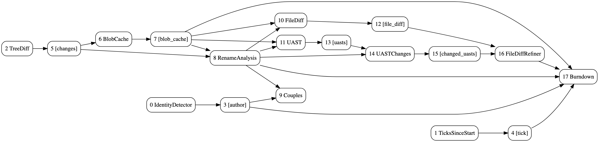
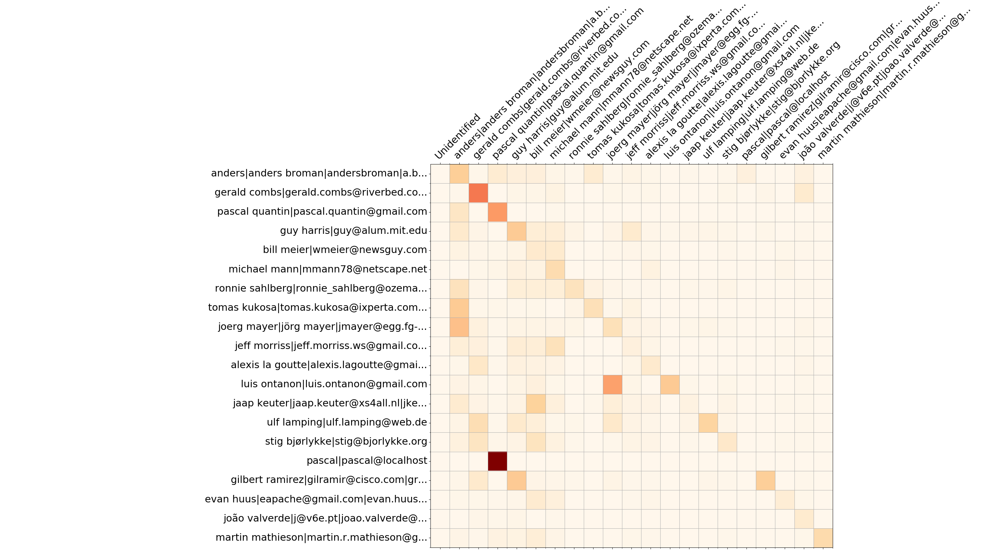
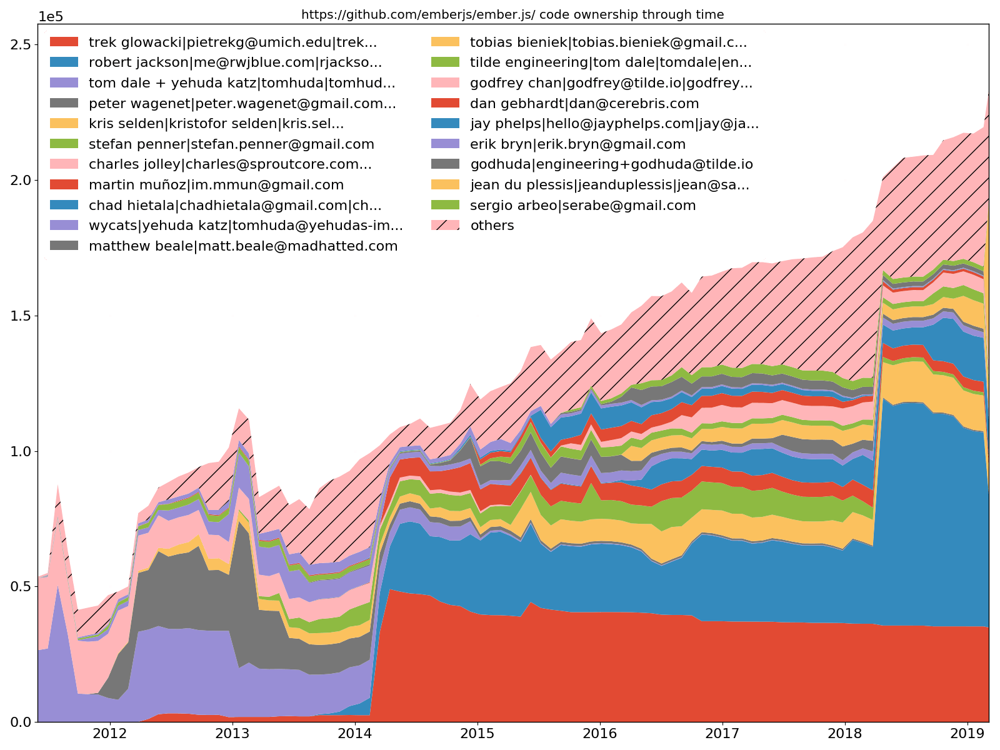
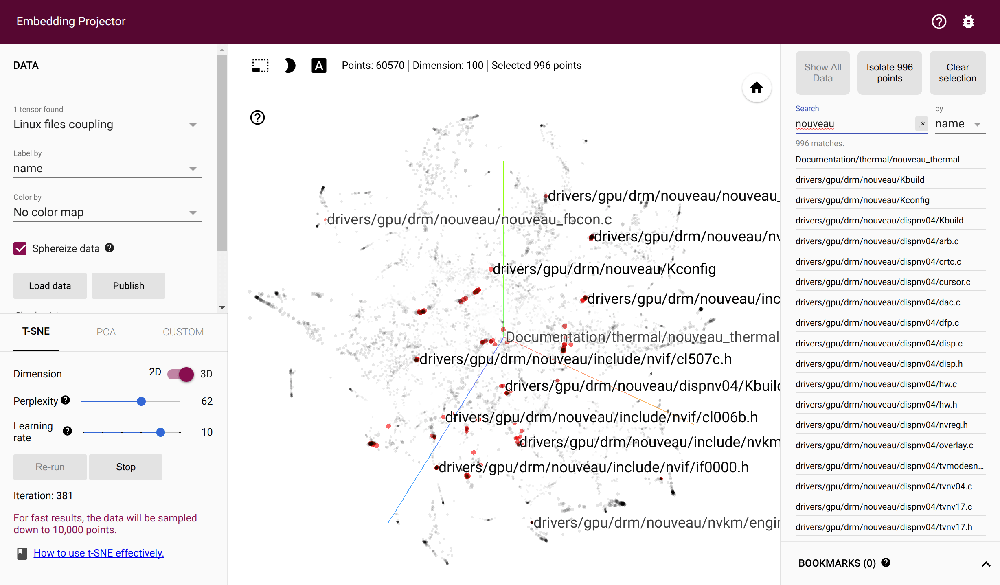
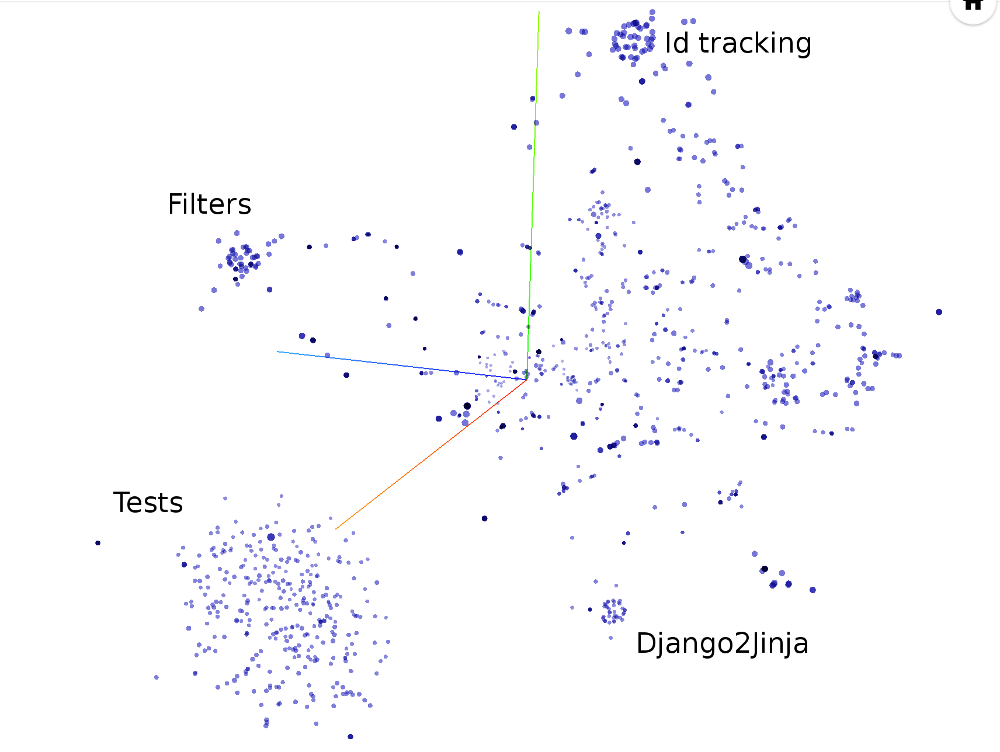
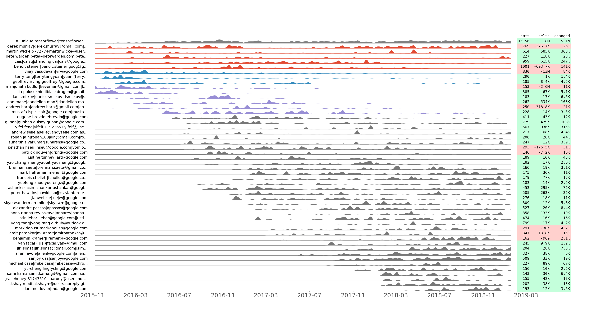
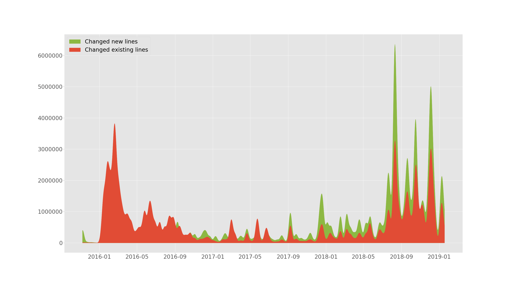
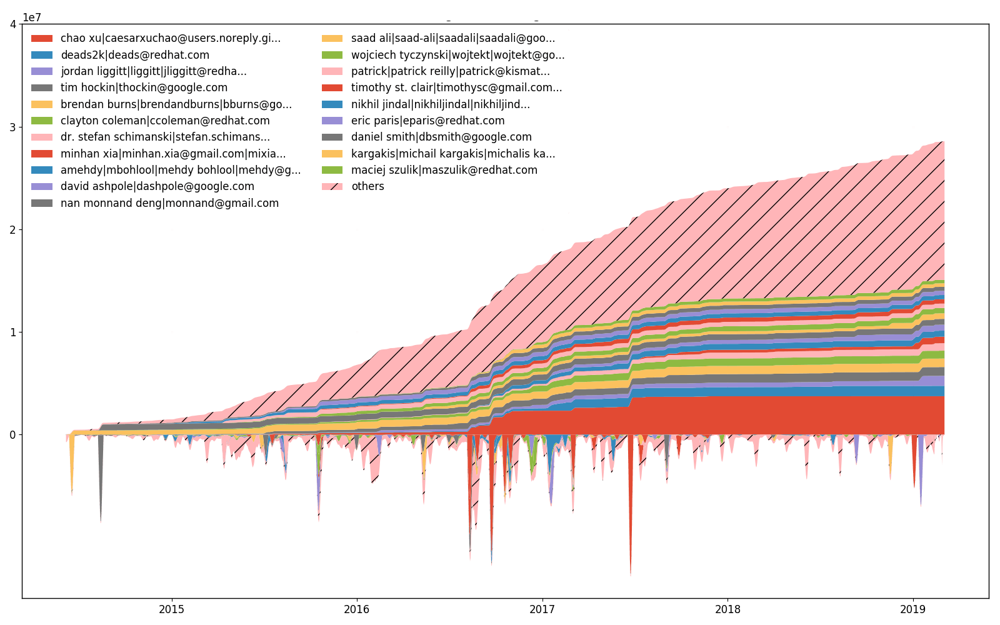
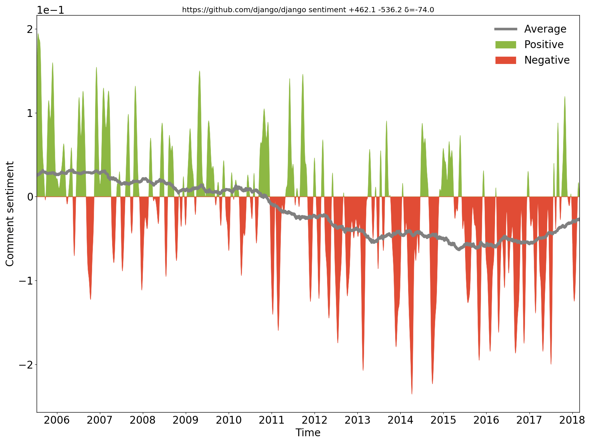
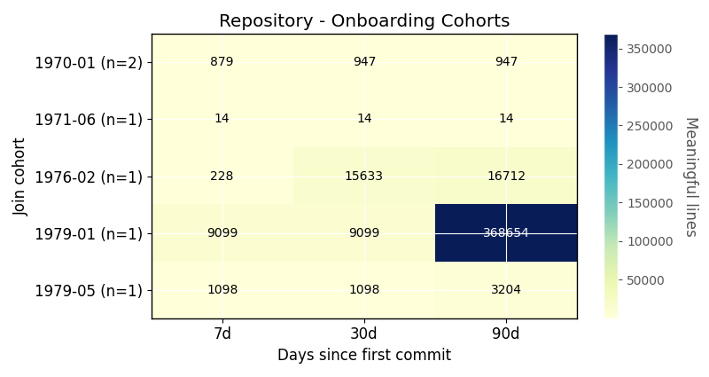

<p align="center">

</p>
<h1 align="center">Hercules</h1>
<p align="center">
      Fast, insightful and highly customizable Git history analysis.<br><br>
      <a href="https://pkg.go.dev/github.com/cwbudde/hercules"></a>
      <a href="https://github.com/cwbudde/hercules/actions"></a>
      <a href="https://goreportcard.com/report/github.com/cwbudde/hercules"></a>
      <a href="https://opensource.org/licenses/Apache-2.0"></a>
</p>
<p align="center">
  <a href="#overview">Overview</a> •
  <a href="#usage">How To Use</a> •
  <a href="#installation">Installation</a> •
  <a href="#contributions">Contributions</a> •
  <a href="#license">License</a>
</p>

---

# Table of Contents

- [Overview](#overview)
- [Installation](#installation)
  - [Build from source](#build-from-source)
  - [Build tags and optional dependencies](#build-tags-and-optional-dependencies)
  - [GitHub Action](#github-action)
  - [Release and version policy](#release-and-version-policy)
- [Contributions](#contributions)
- [License](#license)
- [Usage](#usage)
  - [Presets](#presets)
  - [Caching](#caching)
  - [GitHub Action](#github-action-1)
  - [Docker image](#docker-image)
  - [Built-in analyses](#built-in-analyses)
    - [Project burndown](#project-burndown)
    - [Files](#files)
    - [People](#people)
    - [Churn matrix](#overwrites-matrix)
    - [Code ownership](#code-ownership)
    - [Couples](#couples)
    - [Structural hotness](#structural-hotness)
    - [Aligned commit series](#aligned-commit-series)
    - [Added vs changed lines through time](#added-vs-changed-lines-through-time)
    - [Efforts through time](#efforts-through-time)
    - [Sentiment (positive and negative comments)](#sentiment-positive-and-negative-comments)
    - [Bus factor](#bus-factor)
    - [Ownership concentration](#ownership-concentration)
    - [Onboarding ramp](#onboarding-ramp)
    - [Everything in a single pass](#everything-in-a-single-pass)
  - [Plugins](#plugins)
  - [Merging](#merging)
  - [Plotting](#plotting)
  - [Custom plotting backend](#custom-plotting-backend)
  - [Caveats](#caveats)
  - [Burndown Out-Of-Memory](#burndown-out-of-memory)

## Overview

Hercules is a fast and highly customizable Git repository analysis engine written in Go.
It builds a dependency-aware DAG of analyses and processes the full commit history in a single run.
Powered by [go-git](https://github.com/go-git/go-git).

This fork focuses on:

- tree-sitter-based structural analyses (no legacy parser service path),
- lightweight default builds (no TensorFlow dependency),
- practical report generation and operational tooling.

There are two command-line tools, both written in Go and built from this repository:
`hercules` and `labours`. The first takes a Git repository and executes a Directed Acyclic
Graph (DAG) of [analysis tasks](docs/PIPELINE_ITEMS.md) over the full commit history.
The second renders predefined plots over the collected data (a native drop-in replacement
for the retired Python `labours` package). The two tools can be chained through a pipe, or
run as a single step with `hercules report`, which renders all charts in-process — no
Python required. It is possible to write custom analyses using the plugin system. It is
also possible to merge several analysis results together - relevant for organizations.
The analyzed commit history includes branches, merges, etc. — non-linear histories are a
supported, tested path (the pipeline forks and merges analysis state across branches; see
the merge-tracking tests in `internal/core`).

Historical context from the original project is available in
[blog post 1](https://blog.sourced.tech/post/hercules-v4),
[blog post 2](https://blog.sourced.tech/post/hercules), and a
[presentation](http://vmarkovtsev.github.io/gowayfest-2018-minsk/).
Please [contribute](#contributions) by testing, fixing bugs, and adding
[new analyses](https://github.com/cwbudde/hercules/issues?q=is%3Aissue+is%3Aopen+label%3Anew-analysis).



<p align="center">The DAG of burndown and couples analyses. Generated with <code>hercules --burndown --burndown-people --couples --dry-run --dump-dag docs/dag.dot https://github.com/cwbudde/hercules</code></p>


<p align="center">torvalds/linux line burndown (granularity 30, sampling 30, resampled by year). Generated with <code>hercules --burndown --first-parent --pb https://github.com/torvalds/linux | labours -f pb -m burndown-project</code> in 1h 40min.</p>

## Installation

Grab the `hercules` binary from the [Releases page](https://github.com/cwbudde/hercules/releases),
or build both `hercules` and `labours` from source (see below). No Python installation is
needed: `labours` is a statically linked Go binary and `hercules report` renders charts
in-process.

### Build from source

You need Go 1.26.5 or newer. The exact minimum is declared in [`go.mod`](go.mod).
For development workflows that regenerate protobuf files or use repo recipes, install
[`protoc`](https://github.com/google/protobuf/releases) and [`just`](https://github.com/casey/just).

```
git clone https://github.com/cwbudde/hercules && cd hercules
# builds both binaries (hercules and labours) plus generated assets
CGO_ENABLED=0 just
# or build them directly
CGO_ENABLED=0 go build ./cmd/hercules
CGO_ENABLED=0 go build ./cmd/labours
```

These exact commands run in CI. `CGO_ENABLED=0` is intentional even on machines where Go enables
cgo by default: the renderer dependency's native FreeType implementation is selected by cgo and
requires a separately prepared native library, while the supported renderer embeds its fonts and
is pure Go.

### Build tags and optional dependencies

Default build:

```
CGO_ENABLED=0 go build ./cmd/hercules
```

- No external parser service dependency.
- No TensorFlow dependency.
- `--shotness` and `--typos-dataset` use tree-sitter by default.
- Tree-sitter is the only structural parsing backend.
- The supported default build is fully cgo-free. `CGO_ENABLED=0 go build ./cmd/hercules`
  produces a statically linked binary and cross-compiles cleanly to
  linux/{amd64,arm64}, windows/amd64, and darwin/arm64.
  - LZ4 compression (used for hibernation) is pure-Go via
    `github.com/cwbudde/lz4`. The legacy cgo LZ4 path is retained as opt-in
    via `-tags cgo_lz4` (only the `internal/rbtree` package is affected).
  - Tree-sitter parsing (used by `--shotness`, `--typos-dataset`, and the
    diff refinement pass) runs on the pure-Go runtime
    [`github.com/odvcencio/gotreesitter`](https://github.com/odvcencio/gotreesitter).

Optional TensorFlow build:

```
CGO_ENABLED=1 TAGS="tensorflow purego" just hercules
```

- Enables `--sentiment` (experimental).
- Requires [`libtensorflow`](https://www.tensorflow.org/install/install_go).
- If `--sentiment` is requested without this tag, Hercules prints a clear rebuild hint.

Optional cgo LZ4 build:

```
CGO_ENABLED=1 go build -tags "cgo_lz4 purego" ./cmd/hercules
```

- Restores the legacy cgo-backed LZ4 path for RBTree hibernation.
- Not required for normal releases; the default pure-Go LZ4 path is preferred.

### Migration notes (fork-specific)

This fork intentionally removed the legacy UAST/Babelfish surface and does not preserve backward compatibility for it.

- Removed CLI/feature surface:
  - `--feature uast`
  - `--shotness-xpath-*`
- Removed internal pipeline items:
  - `UAST`
  - `UASTChanges`
  - `FileDiffRefiner` (UAST-based)
- Replacement mode:
  - `--dump-uast-changes` is available again as a tree-sitter-based replacement.
  - It writes `.src` and `.ast.json` artifacts under `--changed-uast-dir`.
  - Legacy protobuf messages for UAST dump payloads are still removed in this fork.
- Protobuf schema change:
  - `UASTChange` and `UASTChangesSaverResults` were removed from `internal/pb/pb.proto`.
  - Older payloads containing these messages are not supported by this fork.
- Final decisions:
  - Protobuf `UAST*` messages were removed, not renamed.
  - `--shotness-xpath-*` compatibility flags were removed, not kept as ignored aliases.

### GitHub Action

It is possible to run Hercules as a [GitHub Action](https://help.github.com/en/articles/about-github-actions):
[Hercules on GitHub Marketplace](https://github.com/marketplace/actions/hercules-insights).
Please refer to the [sample workflow](.github/workflows/main.yml) which demonstrates how to setup.

### Release and version policy

Default release artifacts are built without TensorFlow, without legacy parser services, and without
cgo-only dependencies. The supported release build is:

```
CGO_ENABLED=0 go build ./cmd/hercules
CGO_ENABLED=0 go build ./cmd/labours
```

`hercules version` prints the API version derived from the Go module path plus the Git hash embedded
at build time. Builds made through `just` set the Git hash automatically with `-ldflags`.

See [docs/RELEASE.md](docs/RELEASE.md) for the maintainer checklist, version policy, optional build
tags, and migration notes from the old upstream.

## Contributions

...are welcome! See [CONTRIBUTING](CONTRIBUTING.md) and [code of conduct](CODE_OF_CONDUCT.md).

## License

[Apache 2.0](LICENSE.md)

## Usage

The most useful and reliably up-to-date command line reference:

```
hercules --help
```

Some examples:

```
# Use "memory" go-git backend and display the burndown plot. "memory" is the fastest but the repository's git data must fit into RAM.
hercules --burndown https://github.com/go-git/go-git | labours -m burndown-project --resample month
# Use "file system" go-git backend and print some basic information about the repository.
hercules /path/to/cloned/go-git
# Use the file-system go-git backend, create a Hercules-managed clone cache at /tmp/repo-cache,
# use Protocol Buffers, and display the burndown plot without resampling.
hercules --burndown --pb https://github.com/git/git /tmp/repo-cache | labours -m burndown-project -f pb --resample raw

# Now something fun
# Get the linear history from git rev-list, reverse it
# Pipe to hercules, produce burndown snapshots for every 30 days grouped by 30 days
# Save the raw data to cache.yaml, so that later is possible to labours -i cache.yaml
# Pipe the raw data to labours, set text font size to 16pt, use Agg matplotlib backend and save the plot to output.png
git rev-list HEAD | tac | hercules --commits - --burndown https://github.com/git/git | tee cache.yaml | labours -m burndown-project --font-size 16 --backend Agg --output git.png
```

`labours -i /path/to/yaml` allows to read the output from `hercules` which was saved on disk.

### Presets

`--preset <name>` applies a curated set of flag defaults so you can get a useful first
result without tuning. Explicit flags on the command line always override preset values,
so a preset is a starting point you can fine-tune incrementally.

Two presets ship today:

- `--preset quick` — fastest path to a result. Sets `--head`, so only the most recent
  commit is analysed. Use this to validate that a repo is parseable, sanity-check labours
  rendering, or get a first burndown for a small repo:

  ```
  hercules --preset quick --burndown /path/to/repo | labours -m burndown-project
  ```

- `--preset large-repo` — for repositories where a default run would otherwise OOM or
  take hours. Enables first-parent traversal (`--first-parent`), turns on RBTree
  hibernation with a 200 000-allocation threshold and disk spill
  (`--lines-hibernation-threshold=200000 --lines-hibernation-disk`), and reduces output
  resolution to 30-day buckets (`--granularity=30 --sampling=30`):

  ```
  hercules --preset large-repo --burndown /path/to/big/repo > burndown.yml
  labours -i burndown.yml -m burndown-project
  ```

  Hibernation periodically compresses RBTree allocators and (with `--lines-hibernation-disk`)
  spills them to a temporary file, trading some CPU for a much lower memory ceiling. See
  [docs/HIBERNATION.md](docs/HIBERNATION.md) for the underlying mechanism.

If you find yourself overriding the same preset flag every run, file an issue — the
preset defaults are tunable and we want them to match what users actually need.

### Caching

It is possible to store the cloned repository on disk. The subsequent analysis can run on the
corresponding directory instead of cloning from scratch:

```
# First time - cache
hercules https://github.com/git/git /tmp/repo-cache

# Second time - use the cache
hercules --some-analysis /tmp/repo-cache
```

Hercules clones into a temporary sibling and moves the completed clone into place, so a failed
clone does not leave a partial cache. It refuses to overwrite an existing non-empty path by
default. To intentionally refresh a cache previously created and marked by Hercules, pass
`--force-cache-replace`:

```bash
hercules --force-cache-replace https://github.com/git/git /tmp/repo-cache
```

The force flag never permits replacing an unrelated directory, a symbolic link, a filesystem
root, the current working directory, or the user's home directory. On a platform or filesystem
without atomic directory exchange, replacement fails and the existing cache remains untouched.

### GitHub Action

The action produces the artifact named
`hercules_charts`. Since it is currently impossible to pack several files in one artifact, all the
charts are packed in the inner tar archive.

### Docker image

The runtime image is cgo-free, contains both binaries and CA roots, and runs as a non-root user.
Its builder image is pinned by multi-architecture digest. Docker Buildx can build the two supported
Linux architectures as one image index:

```
docker buildx build --platform linux/amd64,linux/arm64 \
  --output type=oci,dest=hercules-multiarch.tar .
```

CI executes that command and verifies both target builds. To publish an image index, replace the
`--output` option with your registry tag and `--push`.

For a local image on the current architecture:

```
docker build -t hercules .
docker run --rm hercules hercules --preset quick --burndown --pb https://github.com/git/git | \
  docker run --rm -i -v "$(pwd):/io" hercules labours -f pb -m burndown-project -o /io/git_git.png
```

The old `srcd/hercules` Docker image belongs to the upstream project and is not the release artifact
for this fork.

### Built-in analyses

#### Project burndown

```
hercules --burndown
labours -m burndown-project
```

Line burndown statistics for the whole repository.
Exactly the same what [git-of-theseus](https://github.com/erikbern/git-of-theseus)
does but much faster. Blaming is performed efficiently and incrementally using a custom RB tree tracking
algorithm, and only the last modification date is recorded while running the analysis.

All burndown analyses depend on the values of _granularity_ and _sampling_.
Granularity is the number of days each band in the stack consists of. Sampling
is the frequency with which the burnout state is snapshotted. The smaller the
value, the more smooth is the plot but the more work is done.

There is an option to resample the bands inside `labours`, so that you can
define a very precise distribution and visualize it different ways. Besides,
resampling aligns the bands across periodic boundaries, e.g. months or years.
Unresampled bands are apparently not aligned and start from the project's birth date.

#### Files

```
hercules --burndown --burndown-files
labours -m burndown-file
```

Burndown statistics for every file in the repository which is alive in the latest revision.

Note: it will generate separate graph for every file. You don't want to run it on repository with many files.

#### People

```
hercules --burndown --burndown-people [--people-dict=/path/to/identities]
labours -m burndown-person
```

Burndown statistics for the repository's contributors. If `--people-dict` is not specified, the identities are
discovered by the following algorithm:

0. We start from the root commit towards the HEAD. Emails and names are converted to lower case.
1. If we process an unknown email and name, record them as a new developer.
2. If we process a known email but unknown name, match to the developer with the matching email,
   and add the unknown name to the list of that developer's names.
3. If we process an unknown email but known name, match to the developer with the matching name,
   and add the unknown email to the list of that developer's emails.

If `--people-dict` is specified, it should point to a text file with the custom identities. The
format is: every line is a single developer, it contains all the matching emails and names separated
by `|`. The case is ignored. Example file contents:

```
Linus Torvalds|torvalds@linux-foundation.org
Vadim Markovtsev|vadim@sourced.tech|another@one.com
```

If `--people-dict` is not specified a [`.mailmap`](https://git-scm.com/docs/git-check-mailmap) file
will be used if it exists in the latest commit.

Identity discovery can be audited before running people-sensitive analyses:

```
hercules --identity-audit /path/to/repo > identities.json
```

The JSON report lists detected identities, automatic merge decisions with confidence values, and
ambiguous candidates which should be reviewed manually. The automatic heuristic threshold defaults
to `0.92` and can be adjusted:

```
hercules --identity-audit --identity-merge-threshold=0.98 /path/to/repo > identities.json
```

To start a manual identity refinement workflow, generate a template in the same format accepted by
`--people-dict`:

```
hercules --people-dict-template=people.txt /path/to/repo
hercules --burndown --burndown-people --people-dict=people.txt /path/to/repo
```

#### Overwrites matrix



<p align="center">Wireshark top 20 devs - overwrites matrix</p>

```
hercules --burndown --burndown-people [--people-dict=/path/to/identities]
labours -m overwrites-matrix
```

Beside the burndown information, `--burndown-people` collects the added and deleted line statistics per
developer. Thus it can be visualized how many lines written by developer A are removed by developer B.
This indicates collaboration between people and defines expertise teams.

The format is the matrix with N rows and (N+2) columns, where N is the number of developers.

1. First column is the number of lines the developer wrote.
2. Second column is how many lines were written by the developer and deleted by unidentified developers
   (if `--people-dict` is not specified, it is always 0).
3. The rest of the columns show how many lines were written by the developer and deleted by identified
   developers.

The sequence of developers is stored in `people_sequence` YAML node.

#### Code ownership



<p align="center">Ember.js top 20 devs - code ownership</p>

```
hercules --burndown --burndown-people [--people-dict=/path/to/identities]
labours -m ownership
```

`--burndown-people` also allows to draw the code share through time stacked area plot. That is,
how many lines are alive at the sampled moments in time for each identified developer.

#### Couples



<p align="center">torvalds/linux files' coupling in Tensorflow Projector</p>

```
hercules --couples [--people-dict=/path/to/identities]
labours -m couples -o <name> [--couples-tmp-dir=/tmp]
```

The files are coupled if they are changed in the same commit. The developers are coupled if they
change the same file. `hercules` records the number of couples throughout the whole commit history
and outputs the two corresponding co-occurrence matrices. `labours -m couples` renders the
file-coupling, people-coupling and (when collected) shotness-coupling charts from those matrices.
The shotness chart compares entity co-occurrence profiles: cell `(i, j)` is the dot product of
the counters for entities `i` and `j`. Its diagonal is each profile's squared norm; ranked pairs
exclude the diagonal and include only positive, distinct pairs. YAML and Protocol Buffer inputs
use the same matrix construction.
The TensorFlow-based [Swivel embedding](https://github.com/src-d/tensorflow-swivel) training and
[Tensorflow Projector](http://projector.tensorflow.org/) TSV export were features of the retired
Python `labours` package and are not part of the Go renderer.

#### Structural hotness

```
      46  jinja2/compiler.py:visit_Template [FunctionDef]
      42  jinja2/compiler.py:visit_For [FunctionDef]
      34  jinja2/compiler.py:visit_Output [FunctionDef]
      29  jinja2/environment.py:compile [FunctionDef]
      27  jinja2/compiler.py:visit_Include [FunctionDef]
      22  jinja2/compiler.py:visit_Macro [FunctionDef]
      22  jinja2/compiler.py:visit_FromImport [FunctionDef]
      21  jinja2/compiler.py:visit_Filter [FunctionDef]
      21  jinja2/runtime.py:__call__ [FunctionDef]
      20  jinja2/compiler.py:visit_Block [FunctionDef]
```

By default, `--shotness` is powered by tree-sitter and tracks function-level units for Go, Python, JavaScript and TypeScript.
Structural identities combine source path, node kind, and qualified name (including receiver or
enclosing scope when available). Coordinate-only moves within a file preserve an entity; qualified
renames and individual cross-file moves create a new identity. An explicit whole-file rename
migrates the existing identities and their counters to the new path.

```
hercules --shotness
labours -m shotness
```

Couples analysis automatically loads "shotness" data if available.



<p align="center"><code>hercules --shotness --pb https://github.com/pallets/jinja | labours -m couples -f pb</code></p>

#### Aligned commit series



<p align="center">tensorflow/tensorflow aligned commit series of top 50 developers by commit number.</p>

```
hercules --devs [--people-dict=/path/to/identities]
labours -m devs -o <name>
```

We record how many commits made, as well as lines added, removed and changed per day for each developer.
We plot the resulting commit time series using a few tricks to show the temporal grouping. In other words,
two adjacent commit series should look similar after normalization.

1. We compute the distance matrix of the commit series. Our distance metric is
   [Dynamic Time Warping](https://en.wikipedia.org/wiki/Dynamic_time_warping).
   We use [FastDTW](https://cs.fit.edu/~pkc/papers/tdm04.pdf) algorithm which has linear complexity
   proportional to the length of time series. Thus the overall complexity of computing the matrix is quadratic.
2. We compile the linear list of commit series with
   [Seriation](http://nicolas.kruchten.com/content/2018/02/seriation/) technique.
   Particularly, we solve the [Travelling Salesman Problem](https://en.wikipedia.org/wiki/Travelling_salesman_problem) which is NP-complete.
   However, given the typical number of developers which is less than 1,000, there is a good chance that
   the solution does not take much time. We use [Google or-tools](https://developers.google.com/optimization/routing/tsp) solver.
3. We find 1-dimensional clusters in the resulting path with [HDBSCAN](https://hdbscan.readthedocs.io/en/latest/how_hdbscan_works.html)
   algorithm and assign colors accordingly.
4. Time series are smoothed by convolving with the [Slepian window](https://en.wikipedia.org/wiki/Window_function#DPSS_or_Slepian_window).

This plot allows to discover how the development team evolved through time. It also shows "commit flashmobs"
such as [Hacktoberfest](https://hacktoberfest.digitalocean.com/). For example, here are the revealed
insights from the `tensorflow/tensorflow` plot above:

1. "Tensorflow Gardener" is classified as the only outlier.
2. The "blue" group of developers covers the global maintainers and a few people who left (at the top).
3. The "red" group shows how core developers join the project or become less active.

#### Added vs changed lines through time



<p align="center">tensorflow/tensorflow added and changed lines through time.</p>

```
hercules --devs [--people-dict=/path/to/identities]
labours -m old-vs-new -o <name>
```

`--devs` from the previous section allows to plot how many lines were added and how many existing changed
(deleted or replaced) through time. This plot is smoothed.

#### Efforts through time



<p align="center">kubernetes/kubernetes efforts through time.</p>

```
hercules --devs [--people-dict=/path/to/identities]
labours -m devs-efforts -o <name>
```

Besides, `--devs` allows to plot how many lines have been changed (added or removed) by each developer.
The upper part of the plot is an accumulated (integrated) lower part. It is impossible to have the same scale
for both parts, so the lower values are scaled, and hence there are no lower Y axis ticks.
There is a difference between the efforts plot and the ownership plot, although changing lines correlate
with owning lines.

#### Sentiment (positive and negative comments)



<p align="center">It can be clearly seen that Django comments were positive/optimistic in the beginning, but later became negative/pessimistic.<br><code>hercules --sentiment --pb https://github.com/django/django | labours -m sentiment -f pb</code></p>

`--sentiment` is experimental and optional. It is unavailable in default release builds.

We extract new and changed comments from source code on every commit, apply [BiDiSentiment](https://github.com/vmarkovtsev/bidisentiment)
general purpose sentiment recurrent neural network and plot the results. This analysis requires
[libtensorflow](https://www.tensorflow.org/install/install_go) and a `tensorflow` build tag.
E.g. [`sadly, we need to hide the rect from the documentation finder for now`](https://github.com/pygame/pygame/commit/b6091d38c8a5639d311858660b38841d96598509#diff-eae59f175858fcef57cb17e733981c73R27) is negative and
[`Theano has a built-in optimization for logsumexp (...) so we can just write the expression directly`](https://github.com/keras-team/keras/commit/7d52af64c03e71bcd23112a7086dc8aab1b37ed2#diff-ff634bb5c5441d7052449f20018872b8R549)
is positive. Don't expect too much though - as was written, the sentiment model is
general purpose and the code comments have different nature, so there is no magic (for now).

Hercules must be built with the `tensorflow` tag - it is not enabled by default:

```
CGO_ENABLED=1 TAGS="tensorflow purego" just hercules
```

Such a build requires [`libtensorflow`](https://www.tensorflow.org/install/install_go).
If `--sentiment` is requested in a non-`tensorflow` build, Hercules exits with a rebuild hint.

#### Bus factor

```
hercules --bus-factor [--bus-factor-threshold=0.8] [--people-dict=/path/to/identities]
labours -m bus-factor
```

The [bus factor](https://en.wikipedia.org/wiki/Bus_factor) is the minimum number of developers whose
departure would leave the project without sufficient knowledge to maintain it. Hercules computes this
over time by finding the smallest set of developers who collectively own at least 80% (configurable
via `--bus-factor-threshold`) of the living code lines. Each occupied tick records ownership after
that tick's last commit and before any later tick. Required coverage is rounded up to a whole line,
so the configured threshold remains exact for small repositories.

The analysis produces three visualizations:

1. **Timeline** - a step chart showing how the bus factor evolves over the project's lifetime, with
   a danger zone highlight at BF=1.
2. **Gauge** - a summary of the current bus factor value color-coded by risk level
   (critical/low/moderate/healthy), alongside a pie chart of top code owners.
3. **Subsystems** - a horizontal bar chart breaking down bus factor by top-level directory,
   making it easy to spot which parts of the codebase are most at risk.

#### Ownership concentration

```
hercules --ownership-concentration [--people-dict=/path/to/identities]
labours -m ownership-concentration
```

The [Gini coefficient](https://en.wikipedia.org/wiki/Gini_coefficient) and
[Herfindahl-Hirschman Index](https://en.wikipedia.org/wiki/Herfindahl%E2%80%93Hirschman_index)
quantify how concentrated or distributed code ownership is. Gini=0 means perfectly equal
ownership, Gini=1 means one person owns everything. HHI ranges from 1/n (equal) to 1.0
(single author). Both metrics are tracked over time using the same line ownership data as
the bus factor analysis. Their occupied-tick and final subsystem snapshots use the same
incremental ownership accounting as Bus Factor.

The analysis produces two visualizations:

1. **Timeline** - a dual-axis step chart showing Gini and HHI evolving over the project's
   lifetime, with reference lines for moderate and high concentration.
2. **Subsystems** - a grouped horizontal bar chart comparing Gini and HHI by top-level
   directory.

#### Onboarding ramp

```
hercules --onboarding [--onboarding-windows=7,30,90] [--onboarding-meaningful-threshold=10]
```

The onboarding analysis tracks how quickly new contributors ramp up after their first commit.
It groups authors by monthly join cohort and measures commits, files, and changed lines at
configurable day windows. Cohorts use the local calendar month encoded in each author's first
commit timestamp. Windows are exact elapsed 24-hour periods from that timestamp, include commits
on the boundary, and never include a later commit merely because it shares a tick.

An `onboarding` render mode is not yet implemented in the Go renderer, so consume the
YAML/protobuf output directly. The retired Python renderer produced two visualizations
from this data (shown below):

1. **Cohort heatmap** - average meaningful lines by join cohort and days since first commit.
2. **Author ramps** - per-author meaningful-line trajectories for the top contributors in the view.

<p align="center">
  
</p>

#### Everything in a single pass

```
hercules report -o ./report https://github.com/go-git/go-git
```

This command runs Hercules in Protocol Buffers mode, renders the charts with the
built-in in-process renderer (no separate `labours` process and no Python needed),
and transactionally publishes a report directory with generated plots, `report.pb`,
`index.html`, and a `manifest.json` inventory. Each run starts in a fresh staging
directory, so rerunning with fewer modes removes charts from the previous run. In
`--strict` mode, a rendering failure leaves any previously published report intact.
The default
report includes the usual project, file, people, ownership, temporal activity,
bus factor, knowledge diffusion, hotspot risk, and refactoring proxy
views without requiring separate `labours` flags. An external drop-in renderer can
be substituted with `--labours-cmd`.

From a source checkout, the same report can be generated with:

```
just report https://github.com/go-git/go-git
```

Use `--all` to request every report mode, including optional or heavier views:

```
hercules report --all -o ./report https://github.com/go-git/go-git
```

To customize the report scope, pass explicit analysis flags and modes:

```
hercules report --analysis burndown --analysis devs --mode burndown-project --mode devs -o ./report <repo>
```

Manual pipeline chaining is still supported:

```
hercules --burndown --burndown-files --burndown-people --couples --shotness --devs [--people-dict=/path/to/identities]
labours -m all
```

### Plugins

Hercules has a plugin system and allows to run custom analyses. See [PLUGINS.md](PLUGINS.md).

Status: plugins are supported with an important caveat — Go plugins require cgo, while the
default build of hercules (`just`, releases, Docker) is `CGO_ENABLED=0` and therefore cannot
load any plugin. To use `--plugin`, build both the plugin and hercules from the same source
tree with `CGO_ENABLED=1`. The compatibility of this path is verified by
`just test-plugin` (`test/plugin_smoke/`).

### Merging

`hercules combine` is the command which joins several analysis results in Protocol Buffers format together.

```
hercules --burndown --pb https://github.com/go-git/go-git > go-git.pb
hercules --burndown --pb https://github.com/cwbudde/hercules > hercules.pb
hercules combine go-git.pb hercules.pb | labours -f pb -m burndown-project --resample M
```

### Plotting

These options affects all plots:

```
labours [--style=white|black] [--size=Y,X] [--theme=default|dark|minimal|vibrant|matplotlib]
```

`--style` sets the general style of the plot (see `labours --help`).
`--background` changes the plot background to be either white or black.
`--size` sets the size of the figure in inches. The default is `12,9`.
`--backend` is accepted for compatibility with the retired Python `labours` CLI.

The Go renderer aims for visual parity with the original matplotlib output; the tracked
parity matrix and how to re-run it are documented in
[docs/RENDER_PARITY.md](docs/RENDER_PARITY.md).

These options are effective in burndown charts only:

```
labours [--text-size] [--relative]
```

`--text-size` changes the font size, `--relative` activate the stretched burndown layout.

### Custom plotting backend

It is possible to output all the information needed to draw the plots in JSON format.
Simply append `.json` to the output (`-o`) and you are done. The data format is not fully
specified and depends on the renderer code which generates it. Each JSON file should
contain `"type"` which reflects the plot kind.

### Caveats

1. Processing all the commits may fail in some rare cases. If you get an error similar to https://github.com/cwbudde/hercules/issues/106
   please report there and specify `--first-parent` as a workaround.
1. Burndown collection may fail with an Out-Of-Memory error. See the next session for the workarounds.
1. `--sentiment` and couples embeddings are optional/experimental TensorFlow-backed paths. They are
   not enabled in default release builds and should not be treated as release-blocking analyses.
1. Parsing huge YAML outputs is slow and memory-hungry (e.g. the Linux kernel in "couples" mode
   produces a 1.5 GB YAML document). Most repositories are parsed within a minute, but for big
   ones prefer Protocol Buffers (`hercules --pb` and `labours -f pb`).

### Burndown Out-Of-Memory

If the analyzed repository is big and extensively uses branching, the burndown stats collection may
fail with an OOM. You should try the following:

1. Read the repo from disk instead of cloning into memory.
2. Use `--skip-blacklist` to avoid analyzing the unwanted files. It is also possible to constrain the `--language`.
3. Use the [hibernation](docs/HIBERNATION.md) feature: `--hibernation-distance 10 --burndown-hibernation-threshold=1000`. Play with those two numbers to start hibernating right before the OOM.
4. Hibernate on disk: `--burndown-hibernation-disk --burndown-hibernation-dir /path`.
5. `--first-parent`, you win.
