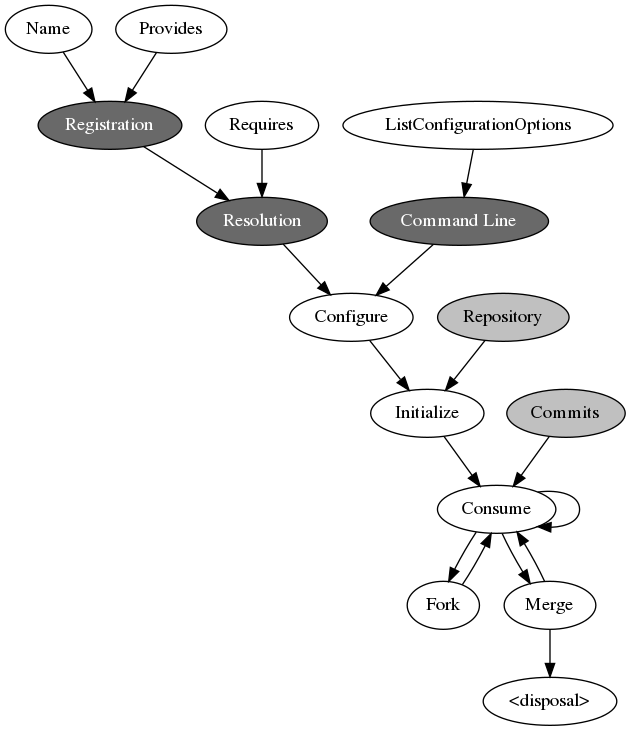
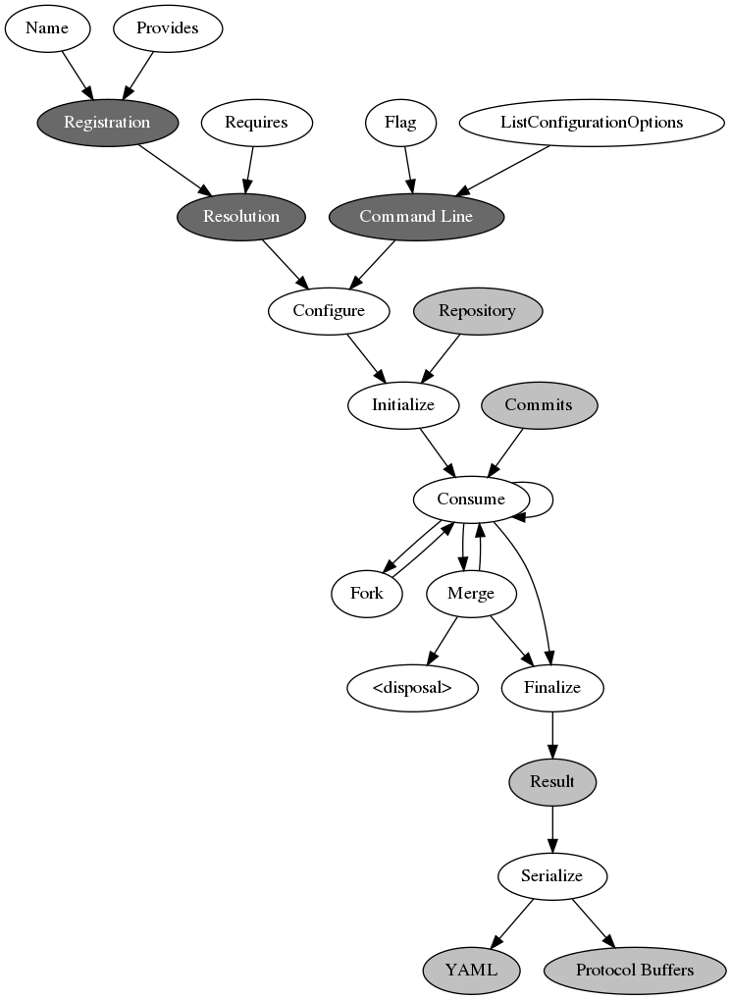
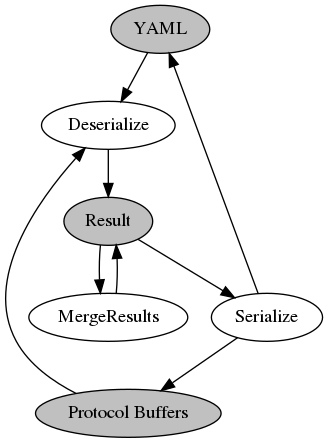

# Pipeline items

Pipeline items are reusable objects with a strict lifecycle. Configuration and run state have
different ownership: configuration survives until the next `Configure` call, while `Initialize`
starts a fresh run and must discard all state produced by an earlier run.

## Lifecycle contract

| Operation           | Configuration                                                                                         | Per-run state and resources                                                                                           |
| ------------------- | ----------------------------------------------------------------------------------------------------- | --------------------------------------------------------------------------------------------------------------------- |
| `Configure`         | Reads immutable inputs from `facts`; may publish shared facts. Replaces previously configured values. | Must not depend on state from an earlier run.                                                                         |
| `ConfigureUpstream` | Reads facts after downstream configuration has completed.                                             | Must not allocate branch-local run state.                                                                             |
| `Initialize`        | Preserves the values established by `Configure`.                                                      | Idempotently discards the previous run, then creates empty state for the supplied repository.                         |
| `Consume`           | Read-only.                                                                                            | Advances exactly one branch with one commit and returns every declared output.                                        |
| `Fork(n)`           | Shared or copied, but never changed.                                                                  | Returns `n` branch instances representing the same state as the receiver at the fork point.                           |
| `Merge(branches)`   | Unchanged.                                                                                            | Combines the supplied fork state into the receiver and synchronizes branches which may continue.                      |
| `Hibernate`         | Unchanged.                                                                                            | Compacts or externalizes state without changing its logical value. Repeated calls must be safe.                       |
| `Boot`              | Unchanged.                                                                                            | Restores the exact pre-hibernation value. Repeated calls must be safe.                                                |
| `Finalize`          | Read-only.                                                                                            | Produces a result without transferring ownership of item resources.                                                   |
| `Dispose`           | Unchanged, so another `Initialize` is valid.                                                          | Idempotently releases files, allocators, workers, and other resources. No `Consume` is valid until re-initialization. |

The pipeline calls `Dispose` once for every unique disposable item and branch clone after both
successful and failed execution. It also disposes initialized resources when initialization fails,
panics, or is replaced by another initialization. Implementations still make `Dispose` idempotent:
cleanup may be requested for a partially initialized item.

The pipeline's execution plan and active resource list are per-cycle state. They are kept apart from
the pipeline topology, feature selection, callbacks, and user options. Item implementations should
follow the same separation, even where compatibility requires configuration and run fields to remain
in one Go struct.

The registry-wide `TestRegisteredDefaultItemsConformToLifecycle` fixture is the reusable
conformance gate. Every registered item in the default Git execution path is initialized twice
before use, run twice across a branch and merge, and checked for equivalent results. Optional
build-time integrations must fail repeatedly with the same capability error. Resource-specific
tests additionally verify cleanup after initialization errors, panics, consume errors, hibernation,
and repeated disposal.

## `PipelineItem`

```go
type PipelineItem interface {
	Name() string
	Provides() []string
	Requires() []string
	ListConfigurationOptions() []ConfigurationOption
	Configure(facts map[string]any) error
	ConfigureUpstream(facts map[string]any) error
	Initialize(repository *git.Repository) error
	Consume(deps map[string]any) (map[string]any, error)
	Fork(n int) []PipelineItem
	Merge(branches []PipelineItem)
}
```



## Optional lifecycle interfaces

Items with unmanaged resources implement:

```go
type DisposablePipelineItem interface {
	PipelineItem
	Dispose()
}
```

Items which support branch-state compaction implement:

```go
type HibernateablePipelineItem interface {
	PipelineItem
	Hibernate() error
	Boot() error
}
```

See [hibernation](HIBERNATION.md) for the storage behavior.

## Leaf and result interfaces

```go
type LeafPipelineItem interface {
	PipelineItem
	Flag() string
	Description() string
	Finalize() any
	Serialize(result any, binary bool, writer io.Writer) error
}
```



```go
type ResultMergeablePipelineItem interface {
	LeafPipelineItem
	Deserialize(message []byte) (any, error)
	MergeResults(r1, r2 any, c1, c2 *CommonAnalysisResult) any
}
```


